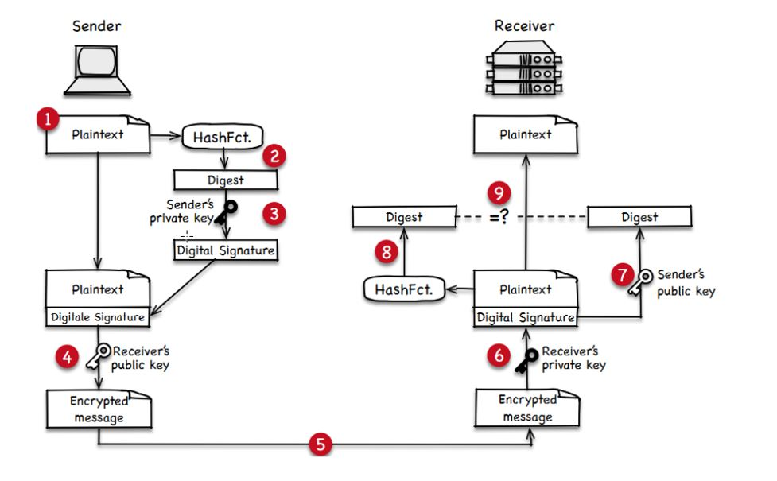

**Ablauf einer asymmetrisch verschlüsselten Kommunikation**
1) Sender erstellt eine Nachricht mit Inhalt. 
2) Hashfunktion wird auf Nachricht angewendet, um einen Digest einer begrenzten Länge zu generieren.
3) Sender benutzt seinen privaten Schlüssel, um den Digest zu verschlüsseln, woraus sich die digitale Signatur ergibt. Niemand kann die digitale Signatur des Senders replizieren. 
4) Sender verschlüsselt sowohl die originale Nachricht als auch die digitale Signatur mit dem öffentlichen Schlüssel des Empfängers. 
5) Das verschlüsselte Bündel aus Nachricht und digitaler Signatur wird an den Empfänger übertragen. 
6) Der Empfänger nutzt seinen privaten Schlüssel, um das empfangene Bündel zu entschlüsseln. 
7) Der Empfänger nutzt den öffentlichen Schlüssel des Senders, um die digitale Signatur zu entschlüsseln und den Digest der Originalnachricht zu extrahieren. 
8) Mithilfe derselben Hashfunktion aus Schritt 2 erstellt der Empfänger einen Digest der empfangenen und in Schritt 6 entschlüsselten Nachricht. 
9) Der Empfänger vergleicht diesen Digest mit dem der Originalnachricht, um die Integrität der empfangenen Nachricht zu verifizieren.

**SYMMETRISCHE SCHLÜSSEL**
* Ein symmetrischer Schlüssel wird zum Ver- und Entschlüsseln von Nachrichten verwendet.
* Beiden Kommunikationspartnern muss der symmetrische Schlüssel bekannt sein.
    * Problem: Wie erlangt der Kommunikationspartner den symmetrischen Schlüssel, ohne dass dieser von einem Angreifer abgehört wird?

**ASYMMETRISCHE SCHLÜSSEL**
* Jeder Kommunikationspartner verfügt über ein Schlüsselpaar, bestehend aus einem öffentlichen und einem privaten Schlüssel.
* Eine mit dem öffentlichen Schlüssel codierte Übertragung kann nur mit dem zugehörigen privaten Schlüssel entschlüsselt werden und umgekehrt.
* Privater Schlüssel ist ein Geheimnis und darf mit niemandem geteilt werden.
* Öffentlicher Schlüssel kann mit jedermann geteilt werden, auch mit Dritten, die nicht an der Kommunikation beteiligt sind.
* Zweck: Vertraulichkeit und Authentifizierung.
    * Vertraulichkeit wird erreicht, indem die Datenübertragung mit dem öffentlichen Schlüssel des Empfängers codiert wird, d.h. nur der legitimierte Empfänger kann die Übertragung mit dem zugehörigen privaten Schlüssel entschlüsseln.
  * Authentisierung erfolgt mittels einer Signatur der Nachricht, die der Sender mit seinem privaten Schlüssel codiert.

**DIGITALE SIGNATUR**
* Eine Digitale Signatur dient der Authentifizierung des Senders einer Übertragung und stellt zugleich die Integrität der Übertragung sicher.
* Von der zu sendenden Nachricht wird mit Hilfe einer Hash-Funktion ein Digest (Auszug) einer begrenzten Länge berechnet.
* Der Digest wird mit dem privaten Schlüssel des Senders verschlüsselt und bildet somit die Digitale Signatur.
* Die Signatur wird an die zu übertragende Nachricht angehängt.
* Der Empfänger entschlüsselt die Signatur mit dem öffentlichen Schlüssel des Senders und erhält den ursprünglichen Digest.
* Der Empfänger berechnet anhand derselben Hash-Funktion einen Digest von der übertragenden Nachricht.
* Sind berechneter und empfangener Digest identisch, ist der Sender authentifiziert und die Integrität der Nachricht ist sichergestellt.

**DIGITALES ZERTIFIKAT**
* Ein Digitales Zertifikat ist eine durch eine Zertifizierungsstelle ausgestellte Urkunde, die im Wesentlichen den öffentlichen Schlüssel des Zertifikatsinhabers enthält.
* Zertifikatsinhaber ist durch Name und Adresse, insbesondere aber auch durch ein oder mehrere Domain-Namen hinterlegt.
* Zertifizierungsstelle ist eine vertrauenswürdige Partei, welche das Digitale Zertifikat herausgibt und mit ihrem privaten Schlüssel digital signiert.
* Der Zertifikatsinhaber übersendet seinen Kommunikationspartnern sein Zertifikat und teilt ihnen damit seinen öffentlichen Schlüssel mit.
* Die Empfänger eines Zertifikats überprüfen die digitale Signatur des Zertifikats - sie benötigen dafür den öffentlichen Schlüssel der Zertifizierungsstelle.
* Zertifikate garantieren, dass ein öffentlicher Schlüssel tatsächlich zu der Person gehört, die sie vorgibt zu sein, und verhindern die Verfälschung von Identitätsangaben (insbesondere des DNS-Namens) oder des öffentlichen Schlüssels.